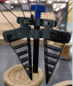
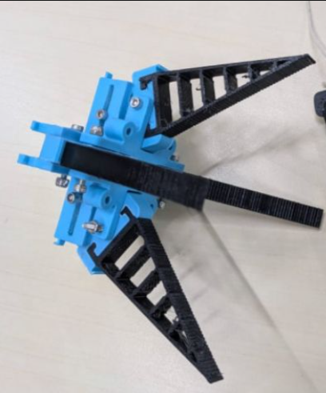
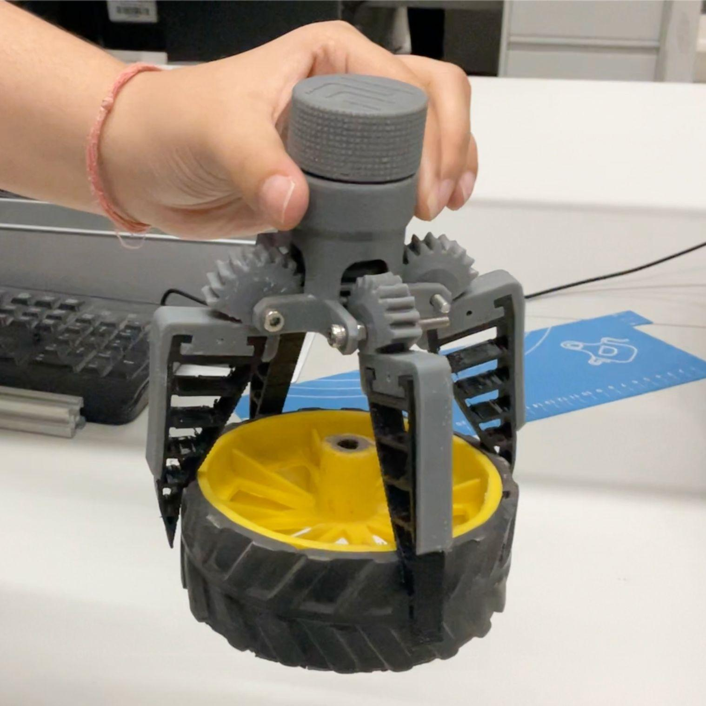

# Grippers for Underwater Manipulation

**Dipti Dhawade** · **Sai Chinmayi Kalapatapu** · **Tanu Adhikari** · **Uday Sodhi**  
Plaksha University

**Mentor:** Prof. Sandeep Manjanna, Plaksha University

> 🏆 **3rd Place — SP Dutt Award For Innovation and Impact**

---

Underwater manipulation remains one of the most challenging unsolved problems in marine robotics. Gripping objects underwater is fundamentally harder than in open air, water creates drag that pushes objects away as fingers approach, surfaces become slippery, and buoyancy alters effective object weight. Most industrial grippers use rigid fingers that can crush fragile specimens such as corals and sponges. The ability of a robot to physically pick up, handle, or interact with objects underwater is critical for tasks like marine biology sampling, pipeline inspection, infrastructure repair, and environmental monitoring.

Our motivation comes from our AUV project, where we found our vehicle could navigate and detect objects but had no reliable way to interact with them physically. Through our literature review, we learned that underwater grippers must serve three core functions: detachment, collection, and storage. Each demands fundamentally different gripper behaviours [1]. Rigid parallel and claw grippers dominate current designs but offer poor force control and no tactile feedback. Soft grippers address some limitations but risk tearing under cyclic pressure.

Gathering these reflections, we set out to design a general-purpose underwater gripper; one capable of reliably grasping a range of object types, including but not limited to spherical, rigid, delicate and slippery objects. Our approach uses the fin-ray effect [2], a mechanism inspired by ray-finned fish bone structure, where flexible fingers passively conform around an object upon contact, distributing load rather than concentrating it. Starting from an open-source three-finger design, we iterated to a four-finger configuration, redesigned the worm-follower actuation base, modified internal finger structures, and relocated the pivot point to increase opening range. Prototypes were 3D-printed in TPU and ABS to make them lightweight, water-resistant, and cheaper.

Testing revealed a key tradeoff: the relocated pivot improved opening range but introduced a fingertip gap that prevented grasping small objects. This motivated exploration of a rack-and-pinion mechanism, where a central gear drives all fingers simultaneously, decoupling opening range from pivot geometry. We are also investigating full silicone fingers to improve grip on slippery surfaces while protecting delicate specimens.

---

## Prototype Iterations

| Fig 1 — 3-finger fin-ray gripper | Fig 2 — Iterated 4-finger design | Fig 3 — Iterated 4-finger rack-and-pinion |
|:-:|:-:|:-:|
|  |  |  |
| *(Inspired by: "LAD Robotics")* | *(Inspired by: "Print Challenge")* | *(Inspired by: "Print Challenge")* |

---

## Next Steps

The next phase involves fabricating and comparing the fin-ray prototype against alternative mechanisms across defined test objects. Through our project, we aim to contribute towards expanding the current literature available on underwater grippers and the development of a more reliable, versatile, and damage-minimising gripper solution for critical marine manipulation tasks.

---

## References

[1] Mazzeo, A., Aguzzi, J., Calisti, M., Canese, S., Angiolillo, M., Allcock, A.L., Vecchi, F., Stefanni, S. and Controzzi, M., 2022. Marine robotics for deep-sea specimen collection: a taxonomy of underwater manipulative actions. *Sensors*, 22(4), p.1471.

[2] Sofla, M.S., Golshanian, H., Sklar, E.I. and Calisti, M., 2025. Modeling and modification of fin-ray effect grippers to improve their load capacity and grasp stability. *Sensors and Actuators A: Physical*, 392, p.116711.
